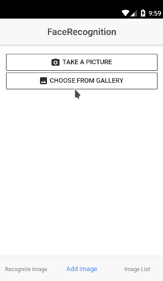
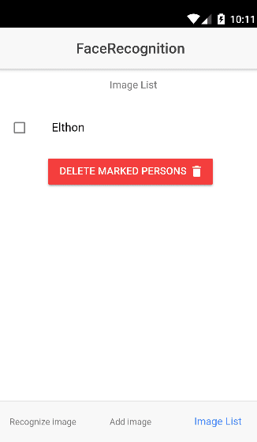

# FaceRecognition Application

## The app + API 

- FaceRecognition is a facial recognition application that was developed with the help of a 99.38% trained model that runs on an API also developed by us. This application communicates with the API receiving the image sent and returning it with the face recognition.

## Steps for recognition using the app ( add image | list image | recognize )

    

        
    

    

     
    

    

    
    

## Repository of the API
- [API](https://github.com/silvaemerson/face_recognition_api) developed in Python with Flask framework;

## Framework used: 
- This app was made using [Ionic framework](https://github.com/ionic-team/ionic)
- API developed with [Flask framework](http://flask.pocoo.org/) 

## Team 

- [Émerson Silva](https://github.com/SilvaEmerson)
- [Luís Eduardo](https://github.com/luiseduardogfranca)

